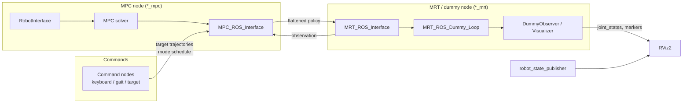
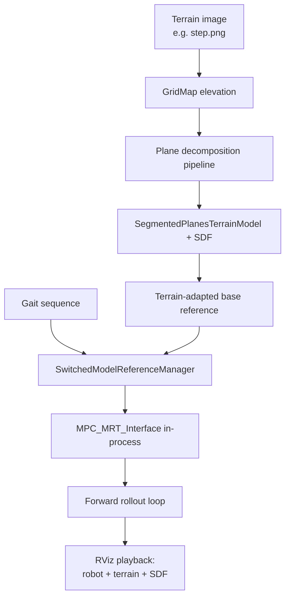

# OCS2 Robotic Examples — ROS 2 Architecture Guide

This document explains how the OCS2 robotic examples work end-to-end on the **ROS 2 Jazzy** branch, with a focus on:

- `ocs2_cartpole_ros`
- `ocs2_quadrotor_ros`
- `ocs2_legged_robot_ros`
- `ocs2_perceptive_anymal`

It is written for use with the **developer Docker environment** (`docker/Dockerfile.dev` + `docker-compose.yml`).

---

## Table of Contents

1. [Environment Setup](#environment-setup)
2. [OCS2 Architecture Overview](#ocs2-architecture-overview)
3. [Common ROS 2 Pattern (MPC + MRT)](#common-ros-2-pattern-mpc--mrt)
4. [Package Layout](#package-layout)
5. [Example: Cartpole](#example-cartpole)
6. [Example: Quadrotor](#example-quadrotor)
7. [Example: Legged Robot](#example-legged-robot)
8. [Example: Perceptive ANYmal](#example-perceptive-anymal)
9. [Comparison Summary](#comparison-summary)
10. [Extending to Real Hardware](#extending-to-real-hardware)

---

## Environment Setup

The dev Docker image provides ROS 2 Jazzy, Pinocchio (via robotpkg), grid-map, plane segmentation, and pre-cloned assets.

### One-time host setup

```bash
xhost +local:docker
docker compose -f docker/docker-compose.yml build
docker compose -f docker/docker-compose.yml up -d
```

### Build inside the container

```bash
docker compose -f docker/docker-compose.yml exec ocs2 bash

# Inside container — workspace root is /ws
cd /ws
colcon build --symlink-install --cmake-args -DCMAKE_BUILD_TYPE=RelWithDebInfo
source install/setup.bash
```

The repo is bind-mounted at `/ws/src/ocs2`. Build artifacts live in `/ws/{build,install,log}` on the host under `ws/`.

### External dependencies (already in Dockerfile.dev)

| Dependency | Purpose |
|------------|---------|
| `ocs2_robotic_assets` (ros2 branch) | URDFs for cartpole, ANYmal, etc. |
| `elevation_mapping_cupy/plane_segmentation` | Convex plane decomposition for perceptive ANYmal |
| Pinocchio + HPP-FCL | Dynamics, kinematics, collision |
| grid_map | Terrain maps for perceptive demo |

---

## OCS2 Architecture Overview

OCS2 (**O**ptimal **C**ontrol for **S**witched **S**ystems) formulates nonlinear optimal control problems and solves them in real time with MPC. Each robotic example follows the same layered design:

```
┌─────────────────────────────────────────────────────────────────┐
│  ROS 2 layer (*_ros packages)                                   │
│  - MPC node, MRT dummy node, command nodes, visualization       │
│  - ocs2_ros_interfaces: MPC_ROS_Interface, MRT_ROS_Interface  │
└───────────────────────────┬─────────────────────────────────────┘
                            │
┌───────────────────────────▼─────────────────────────────────────┐
│  Robot interface (ocs2_<robot> packages)                        │
│  - Loads task.info, builds OptimalControlProblem                │
│  - Dynamics (CppAD or analytical), costs, constraints           │
│  - Rollout integrator, ReferenceManager, Initializer              │
└───────────────────────────┬─────────────────────────────────────┘
                            │
┌───────────────────────────▼─────────────────────────────────────┐
│  OCS2 core (ocs2_core, ocs2_oc, ocs2_mpc, ocs2_ddp, ocs2_sqp…)  │
│  - Solvers: SLQ/iLQR (DDP), SQP, SLP, IPM                       │
│  - Switched-system logic, synchronized modules                  │
└─────────────────────────────────────────────────────────────────┘
```

### Key concepts

| Concept | Role |
|---------|------|
| **OptimalControlProblem** | Defines dynamics, costs, constraints, mode schedule |
| **MPC (Model Predictive Control)** | Re-solves the OCP at each step over a receding horizon |
| **MRT (Model Reference Tracking)** | Applies the latest MPC policy to the plant (real or simulated) |
| **SystemObservation** | Current `(time, state, input, mode)` sent from plant to MPC |
| **TargetTrajectories** | Desired state/input references over time (cost function targets) |
| **ModeSchedule** | Contact/gait mode sequence for switched (hybrid) systems |
| **Synchronized modules** | Hooks that run before each solver iteration (gait receiver, terrain receiver, …) |
| **Rollout** | Forward-simulates dynamics under a controller (used by dummy loop) |

### Solvers used in these examples

| Example | Default solver | Alternatives |
|---------|---------------|--------------|
| Cartpole | Gauss-Newton DDP (SLQ) | — |
| Quadrotor | Gauss-Newton DDP (iLQR) | — |
| Legged robot | DDP, SQP, or IPM (separate launch files) | `legged_robot_ddp/sqp/ipm.launch.py` |
| ANYmal (standard) | DDP or SQP (from `task.info`) | — |
| ANYmal (loopshaping) | DDP or SQP with loop-shaping augmentation | Perceptive demo uses in-process MPC |

---

## Common ROS 2 Pattern (MPC + MRT)

All interactive examples split computation across **two processes** connected by ROS topics:



### ROS topics and services (prefix = robot name)

For a robot named `cartpole`, `quadrotor`, `legged_robot`, or `anymal`:

| Name | Type | Direction | Purpose |
|------|------|-----------|---------|
| `{prefix}_mpc_observation` | `ocs2_msgs/MpcObservation` | MRT → MPC | Current state, input, mode, time |
| `{prefix}_mpc_policy` | `ocs2_msgs/MpcFlattenedController` | MPC → MRT | Optimized trajectories + controller |
| `{prefix}_mpc_reset` | `ocs2_msgs/srv/Reset` | MRT → MPC | Reset solver with initial targets |
| `{prefix}_mpc_target` | `ocs2_msgs/MpcTargetTrajectories` | Command → MPC | User reference trajectories |
| `{prefix}_mode_schedule` | `ocs2_msgs/ModeSchedule` | Command → MPC | Gait / contact schedule |

The policy topic uses **transient-local** QoS so late-joining subscribers receive the last policy.

### MRT dummy loop lifecycle

1. **Reset**: MRT calls `{prefix}_mpc_reset` with initial target trajectories.
2. **Wait for policy**: Publishes observations until MPC returns the first policy.
3. **Run loop** (two modes from `task.info`):
   - **Synchronized** (`mpcDesiredFrequency > 0`): MPC and simulation run at configured rates (e.g. 100 Hz / 400 Hz).
   - **Real-time** (`mpcDesiredFrequency < 0`): Simulation runs at `mrtDesiredFrequency`; MPC runs as fast as possible.
4. **Each step**:
   - Evaluate policy at current time → apply input
   - Forward-simulate with rollout (if initialized)
   - Notify observers (visualizers) with observation + policy
   - Publish new observation to MPC

### RobotInterface pattern

Each `ocs2_<robot>` package exposes a `*Interface` class (inherits `RobotInterface`) that:

1. Parses `config/<task>/task.info` (and URDF where needed)
2. Builds `OptimalControlProblem` (dynamics, costs, constraints)
3. Creates `TimeTriggeredRollout` for simulation
4. Optionally creates `ReferenceManager` for targets and mode schedules
5. Exposes `mpcSettings()`, solver settings, `getInitialState()`, etc.

ROS nodes are thin wrappers: they instantiate the interface, construct the solver, and call `MPC_ROS_Interface::launchNodes()`.

---

## Package Layout

### ocs2_robotic_examples metapackage

```
ocs2_robotic_examples/
├── ocs2_cartpole/              # OCP definition (no ROS)
├── ocs2_cartpole_ros/          # ROS 2 nodes + launch
├── ocs2_quadrotor/
├── ocs2_quadrotor_ros/
├── ocs2_legged_robot/
├── ocs2_legged_robot_ros/
└── ocs2_perceptive_anymal/     # Multi-package ANYmal stack
    ├── ocs2_switched_model_interface/   # Quadruped OCP, gaits, swing planner
    ├── ocs2_anymal_models/              # URDF, kinematics, COM model
    ├── ocs2_quadruped_interface/        # QuadrupedInterface + ROS MPC/MRT helpers
    ├── ocs2_anymal_mpc/                 # Standard ANYmal MPC nodes
    ├── ocs2_anymal_loopshaping_mpc/     # Loop-shaping + perceptive demo
    ├── ocs2_anymal_commands/            # Gait / target / motion command nodes
    ├── segmented_planes_terrain_model/  # Terrain + SDF for perceptive MPC
    └── ocs2_anymal/                     # Metapackage
```

### Shared ROS infrastructure (outside robotic_examples)

| Package | Role |
|---------|------|
| `ocs2_ros_interfaces` | MPC/MRT ROS bridges, command publishers, visualization helpers |
| `ocs2_msgs` | `MpcObservation`, `MpcFlattenedController`, `ModeSchedule`, … |
| `ocs2_centroidal_model` | Centroidal dynamics for legged robots |
| `ocs2_pinocchio_interface` | Pinocchio integration, end-effector kinematics |

---

## Example: Cartpole

**Simplest constrained example** — swing-up and balance with input limits.

### Model

| Property | Value |
|----------|-------|
| State dim | 4 (pole angle, cart position, angular velocity, cart velocity) |
| Input dim | 1 (horizontal force on cart) |
| Dynamics | Nonlinear cart-pole (CppAD auto-diff) |
| Constraints | Input limits (augmented Lagrangian) |
| Solver | SLQ (continuous-time DDP) |
| Reference | Fixed target in cost (no external command node) |

### Nodes launched by `cartpole.launch.py`

| Node | Executable | Role |
|------|------------|------|
| `cartpole_mpc` | `cartpole_mpc` | MPC solver |
| `cartpole_dummy_test` | `cartpole_dummy_test` | MRT dummy + rollout |
| RViz stack | `visualize.launch.py` | URDF + RViz2 |

### End-to-end flow

1. Launch starts `robot_state_publisher` with cartpole URDF from `ocs2_robotic_assets`.
2. **MPC node** loads `ocs2_cartpole/config/mpc/task.info`, builds `CartPoleInterface`, runs `GaussNewtonDDP_MPC`.
3. **Dummy node** creates `MRT_ROS_Interface`, waits for policy, runs synchronized loop at 400 Hz (MRT) / 100 Hz (MPC).
4. `CartpoleDummyVisualization` publishes `joint_states` from observation state → RViz animates the cartpole.
5. No command node: the cost function drives the pole to the upright target defined in `task.info`.

### Run

```bash
ros2 launch ocs2_cartpole_ros cartpole.launch.py
```

Optional: `task_name:=mpc` selects the config folder under `ocs2_cartpole/config/`.

### Notable code path

```
CartpoleMpcNode.cpp
  → CartPoleInterface(task.info)
  → GaussNewtonDDP_MPC
  → MPC_ROS_Interface("cartpole")

DummyCartpoleNode.cpp
  → MRT_ROS_Interface("cartpole")
  → MRT_ROS_Dummy_Loop + CartpoleDummyVisualization
```

---

## Example: Quadrotor

**6-DoF aerial vehicle** — tracks 3D position and yaw from keyboard commands.

### Model

| Property | Value |
|----------|-------|
| State dim | 12 (position, orientation ZYX, linear velocity, angular velocity) |
| Input dim | 4 (3D moment + collective thrust) |
| Dynamics | Rigid-body quadrotor (CppAD code-generated) |
| Constraints | None (unconstrained) |
| Solver | iLQR (discrete-time DDP) |
| Reference | `RosReferenceManager` ← keyboard command node |

### Nodes launched by `quadrotor.launch.py`

| Node | Executable | Role |
|------|------------|------|
| `quadrotor_mpc` | `quadrotor_mpc` | MPC + RosReferenceManager |
| `quadrotor_dummy_test` | `quadrotor_dummy_test` | MRT dummy |
| `quadrotor_target` | `quadrotor_target` | Keyboard target pose publisher |
| RViz stack | `visualize.launch.py` | Visualization |

### End-to-end flow

1. **Target node** reads keyboard input (Δx, Δy, Δz, Δyaw) and publishes `anymal`-style target trajectories on `quadrotor_mpc_target` (via `TargetTrajectoriesKeyboardPublisher`).
2. **MPC node** subscribes through `RosReferenceManager`, updates cost references, solves iLQR, publishes policy.
3. **Dummy node** rolls out the quadrotor dynamics and publishes TF/markers through `QuadrotorDummyVisualization`.
4. User can fly the quadrotor interactively in RViz by entering displacement commands in the target node terminal.

### Run

```bash
ros2 launch ocs2_quadrotor_ros quadrotor.launch.py
```

Focus the terminal running `quadrotor_target` and enter commands like `1 0 0 0` (move 1 m in x).

---

## Example: Legged Robot

**Switched-system quadruped (ANYmal C)** — centroidal MPC with user-defined gait and base pose commands. This is the canonical template for hybrid locomotion in OCS2.

### Model

| Property | Value |
|----------|-------|
| State dim | 24 (centroidal: base pose, base velocities, joint positions) |
| Input dim | 24 (contact forces + joint velocities) |
| Robot URDF | `ocs2_robotic_assets/resources/anymal_c/urdf/anymal.urdf` |
| Dynamics | Single Rigid Body Dynamics (SRBD) or Full Centroidal Dynamics (configurable) |
| Modes | 16 contact modes (which feet touch ground) |
| Constraints | Zero force (swing), zero velocity (stance), friction cone, swing foot trajectory |
| Solvers | DDP (`legged_robot_ddp_mpc`), SQP (`legged_robot_sqp_mpc`), IPM (`legged_robot_ipm_mpc`) |

### Nodes launched by `legged_robot_ddp.launch.py`

| Node | Executable | Role |
|------|------------|------|
| `legged_robot_ddp_mpc` | `legged_robot_ddp_mpc` | MPC solver |
| `legged_robot_dummy` | `legged_robot_dummy` | MRT dummy + Pinocchio visualization |
| `legged_robot_target` | `legged_robot_target` | Base pose keyboard commands |
| `legged_robot_gait_command` | `legged_robot_gait_command` | Gait template keyboard publisher |
| `robot_state_publisher` | — | ANYmal URDF |
| `rviz2` | — | Legged robot RViz config |

### Architecture specifics

```
LeggedRobotInterface
  ├── PinocchioInterface + CentroidalModelInfo (from URDF)
  ├── SwitchedModelReferenceManager
  │     ├── GaitSchedule (mode sequence over time)
  │     ├── SwingTrajectoryPlanner (foot height in swing)
  │     └── Target trajectories (base tracking)
  ├── Constraints: FrictionCone, ZeroForce, ZeroVelocity, …
  └── Rollout with mode schedule
```

**MPC node extras:**

- `RosReferenceManager` — receives `legged_robot_mpc_target` and mode schedule
- `GaitReceiver` (synchronized module) — injects gait updates from `legged_robot_mpc_mode_schedule` before each solve

**Dummy node extras:**

- `LeggedRobotVisualizer` — publishes joint states, end-effector markers, center of pressure, support polygon

### End-to-end flow

1. **Gait command node** publishes a mode schedule (e.g. trot, stance) to `{prefix}_mode_schedule`.
2. **Target node** publishes base pose references (relative x, y, z, yaw) to `{prefix}_mpc_target`.
3. **GaitReceiver** updates `GaitSchedule` inside the solver before each MPC iteration.
4. **SwitchedModelReferenceManager** combines gait, swing trajectories, and targets into the OCP references.
5. MPC solves for contact forces and joint velocities respecting contact constraints.
6. Dummy integrates the policy, visualizes the full ANYmal mesh in RViz.

### Run

```bash
# DDP (default in docs)
ros2 launch ocs2_legged_robot_ros legged_robot_ddp.launch.py

# SQP (often better for hard constraints)
ros2 launch ocs2_legged_robot_ros legged_robot_sqp.launch.py

# IPM
ros2 launch ocs2_legged_robot_ros legged_robot_ipm.launch.py
```

### Configuration files

| File | Purpose |
|------|---------|
| `ocs2_legged_robot/config/mpc/task.info` | Solver, horizon, costs, constraints, initial state |
| `ocs2_legged_robot/config/command/reference.info` | Default COM height, velocity limits for target node |
| `ocs2_legged_robot/config/command/gait.info` | Gait templates (trot, pace, bound, …) |

---

## Example: Perceptive ANYmal

The largest example stack. It extends the legged-robot pattern with **ANYmal-specific kinematics**, optional **loop-shaping MPC**, and a **perceptive locomotion demo** that plans over segmented terrain.

### Sub-stacks

| Package group | Description |
|---------------|-------------|
| **ocs2_anymal_mpc** | Standard ANYmal MPC (similar API to `ocs2_legged_robot` but ANYmal-specific switched model) |
| **ocs2_anymal_loopshaping_mpc** | Adds loop-shaping augmentation for improved robustness; hosts perceptive demo |
| **ocs2_switched_model_interface** | Core quadruped OCP: COM+kinematic dynamics, gaits, swing planning, friction costs |
| **segmented_planes_terrain_model** | Terrain representation from convex plane decomposition + signed distance field |
| **ocs2_anymal_commands** | ROS command nodes (gait, target, motion playback) |

### Standard ROS demo (MPC + MRT)

Launch files follow the same MPC/MRT split as legged robot, with robot name prefix **`anymal`**.

```bash
# Camel model (simplified URDF)
ros2 launch ocs2_anymal_mpc camel.launch.py

# ANYmal C with loop-shaping MPC
ros2 launch ocs2_anymal_loopshaping_mpc anymal_c.launch.py
```

**Nodes** (from `ocs2_anymal_mpc/launch/mpc.launch.py`):

| Node | Role |
|------|------|
| `ocs2_anymal_mpc_mpc_node` | MPC (DDP or SQP from config) |
| `ocs2_anymal_mpc_dummy_mrt_node` | MRT dummy + quadruped visualizer |
| `gait_command_node` | Interactive gait selection |
| `target_command_node` | Base velocity / pose commands |
| `motion_command_node` | Pre-recorded motion playback |

**QuadrupedMpcNode** (shared helper) wires:

- `GaitReceiver` — gait updates
- `TerrainReceiverSynchronizedModule` — terrain model updates (for live perception)
- `TerrainPlaneVisualizer` — RViz terrain planes
- `SwingPlanningVisualizer` — swing foot trajectories
- `RosReferenceManager` — target trajectories

### Perceptive MPC demo (offline scenario + playback)

`perceptive_mpc_demo.launch.py` runs a **self-contained simulation** — not the standard MPC/MRT split. A single node executes the full pipeline:



**Pipeline steps** (`PerceptiveMpcDemo.cpp`):

1. Load terrain heightmap from `ocs2_anymal_loopshaping_mpc/data/*.png`.
2. Run **convex plane decomposition** (preprocessing → RANSAC → sliding window → postprocessing).
3. Build `SegmentedPlanesTerrainModel` and signed distance field for collision / foot placement.
4. Generate terrain-adapted base reference (`generateExtrapolatedBaseReference`) at commanded forward velocity.
5. Register terrain, gait sequence (stance → trot → stance), and target trajectories on the reference manager.
6. Run closed-loop MPC + rollout at 100 Hz until scenario completes.
7. Loop-playback optimized trajectory in RViz with elevation map, plane boundaries, and SDF point cloud.

### Run perceptive demo

```bash
ros2 launch ocs2_anymal_loopshaping_mpc perceptive_mpc_demo.launch.py
```

Useful launch parameters:

| Parameter | Default | Meaning |
|-----------|---------|---------|
| `forward_velocity` | 0.5 | Walking speed [m/s] |
| `terrain_name` | `step.png` | Heightmap in `data/` |
| `terrain_scale` | 0.35 | Height scaling |
| `adaptReferenceToTerrain` | true | Adapt base reference to local terrain normals |
| `config_name` | `c_series` | MPC config folder |

### Loop-shaping vs standard legged robot

| Aspect | ocs2_legged_robot | ocs2_perceptive_anymal |
|--------|-------------------|--------------------------|
| State representation | Centroidal (Pinocchio) | COM + kinematic switched model |
| URDF | ANYmal C from assets | ANYmal / Camel variants |
| Loop-shaping | No | Optional (extra states for filtering) |
| Terrain | Flat ground implicit | Segmented planes + SDF |
| Perception | None | Plane decomposition from elevation map |

---

## Comparison Summary

| | Cartpole | Quadrotor | Legged Robot | ANYmal (ROS) | ANYmal (Perceptive) |
|---|:---:|:---:|:---:|:---:|:---:|
| **Hybrid / switched** | No | No | Yes | Yes | Yes |
| **Pinocchio / URDF** | URDF viz only | URDF viz only | Full dynamics | Full kinematics | Full + terrain |
| **Command nodes** | None | Target keyboard | Target + gait | Target + gait + motion | Pre-scripted scenario |
| **RosReferenceManager** | No | Yes | Yes | Yes | In-process only |
| **Synchronized modules** | No | No | GaitReceiver | Gait + terrain + viz | N/A (in-process) |
| **Default solver** | SLQ | iLQR | DDP/SQP/IPM | DDP/SQP | DDP/SQP |
| **MPC/MRT split** | Yes | Yes | Yes | Yes | No (single process) |

### Complexity ladder

1. **Cartpole** — minimal OCP, no references over ROS, good first build test.
2. **Quadrotor** — adds `RosReferenceManager` and keyboard commands.
3. **Legged robot** — full switched-system pipeline with gaits and Pinocchio centroidal model.
4. **ANYmal** — production-oriented quadruped stack with richer commands and optional loop-shaping.
5. **Perceptive demo** — terrain perception + reference adaptation + closed-loop playback.

---

## Extending to Real Hardware

The dummy nodes simulate the **plant**. On real hardware, replace `MRT_ROS_Dummy_Loop` with:

1. **State estimator** → publish `{prefix}_mpc_observation` at control rate.
2. **Policy subscriber** → receive `{prefix}_mpc_policy`, evaluate control law.
3. **Low-level controller** → map OCS2 inputs (forces, velocities) to actuator commands.

Keep the **MPC node unchanged** — it is designed to run as a separate process (optionally on a different machine). The MRT side only needs `MRT_ROS_Interface` (or equivalent) without the dummy loop.

Typical integration checklist:

- [ ] Match state/input dimensions and mode encoding to `task.info`
- [ ] Provide initial `{prefix}_mpc_reset` with valid target trajectories
- [ ] Publish observations with consistent timestamps
- [ ] Handle `{prefix}_mode_schedule` from your gait scheduler
- [ ] Tune `mpcDesiredFrequency` / `mrtDesiredFrequency` for your hardware loop

---

## Quick Reference — Launch Commands (Docker)

Inside the dev container after sourcing:

```bash
source /ws/install/setup.bash

# Cartpole
ros2 launch ocs2_cartpole_ros cartpole.launch.py

# Quadrotor
ros2 launch ocs2_quadrotor_ros quadrotor.launch.py

# Legged robot (DDP)
ros2 launch ocs2_legged_robot_ros legged_robot_ddp.launch.py

# ANYmal loop-shaping
ros2 launch ocs2_anymal_loopshaping_mpc anymal_c.launch.py

# Perceptive terrain demo
ros2 launch ocs2_anymal_loopshaping_mpc perceptive_mpc_demo.launch.py
```

---

## Further Reading

- [OCS2 online documentation](https://leggedrobotics.github.io/ocs2/) — solver theory (ROS 1 build instructions; concepts apply to ROS 2)
- [`docker/README.md`](../docker/README.md) — dev container workflow
- [`ocs2_doc/docs/robotic_examples.rst`](../ocs2_doc/docs/robotic_examples.rst) — upstream example overview
- [`installation.md`](../installation.md) — native Jazzy install (alternative to Docker)
